# AI Multi-Agent Orchestrator アーキテクチャ図解

> 各図は **1つのメッセージ** に絞り、シンプルさを優先しています。

---

## 1. システム全体構成

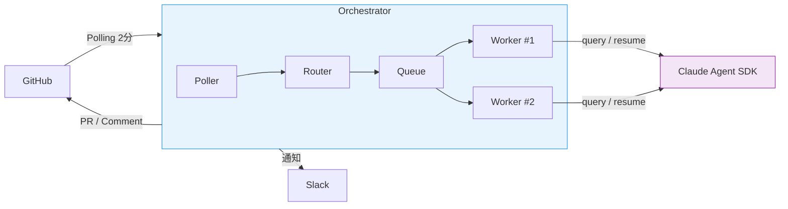
```mermaid
graph LR
    GH[GitHub] -->|Polling 2分| Orch

    subgraph Orch["Orchestrator"]
        Poller --> Router --> Queue
        Queue --> Worker1["Worker #1"]
        Queue --> Worker2["Worker #2"]
    end

    Worker1 -->|query / resume| SDK["Claude Agent SDK"]
    Worker2 -->|query / resume| SDK
    Orch -->|通知| Slack
    Orch -->|PR / Comment| GH

    style Orch fill:#e8f4fd,stroke:#2196f3
    style SDK fill:#f3e5f5,stroke:#9c27b0
```

---

## 2. タイプ別ワークフロー全体像

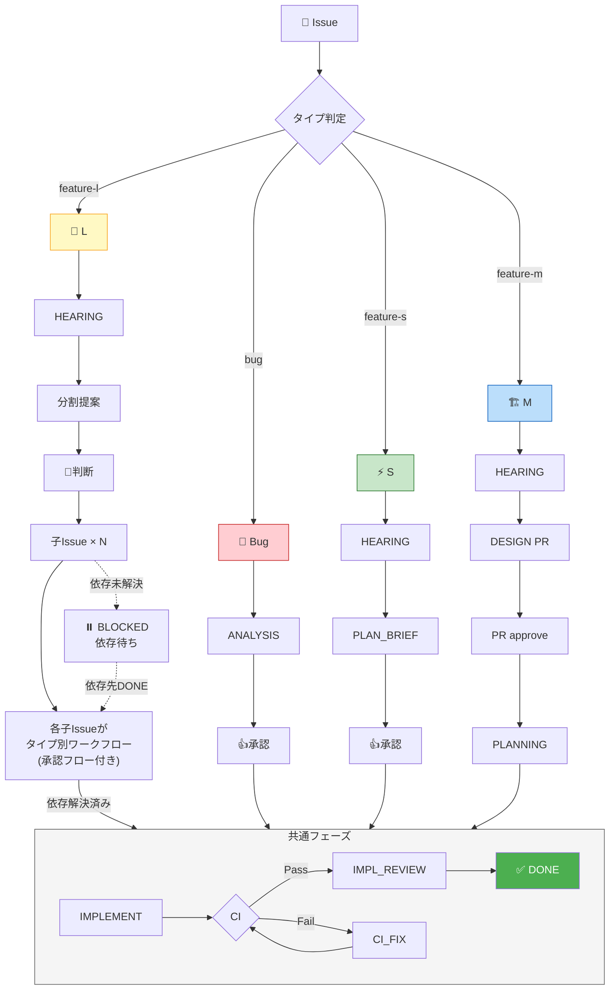
```mermaid
flowchart TB
    Issue["🎫 Issue"] --> Detect{"タイプ判定"}

    Detect -->|bug| Bug["🐛 Bug"]
    Detect -->|feature-s| FS["⚡ S"]
    Detect -->|feature-m| FM["🏗️ M"]
    Detect -->|feature-l| FL["🏢 L"]

    Bug --> BA["ANALYSIS"] --> BA2["👍承認"]
    FS --> FH["HEARING"] --> FP["PLAN_BRIEF"] --> FP2["👍承認"]
    FM --> MH["HEARING"] --> MD["DESIGN PR"] --> MR["PR approve"]
    FL --> LH["HEARING"] --> LS["分割提案"] --> LJ["🧑判断"] --> LC["子Issue × N"]
    LC --> LD["各子Issueが<br/>タイプ別ワークフロー<br/>(承認フロー付き)"]
    LD -->|"依存解決済み"| Common
    LC -.->|"依存未解決"| Blocked["⏸️ BLOCKED<br/>依存待ち"]
    Blocked -.->|"依存先DONE"| LD

    BA2 --> Common
    FP2 --> Common
    MR --> MP["PLANNING"] --> Common

    subgraph Common["共通フェーズ"]
        Impl["IMPLEMENT"] --> CI{"CI"}
        CI -->|Pass| Rev["IMPL_REVIEW"]
        CI -->|Fail| Fix["CI_FIX"] --> CI
        Rev --> Done["✅ DONE"]
    end

    style Bug fill:#ffcdd2,stroke:#c62828
    style FS fill:#c8e6c9,stroke:#2e7d32
    style FM fill:#bbdefb,stroke:#1565c0
    style FL fill:#fff9c4,stroke:#f9a825
    style Common fill:#f5f5f5,stroke:#616161
    style Done fill:#4caf50,color:#fff
```

---

## 3. 🐛 Bug ワークフロー

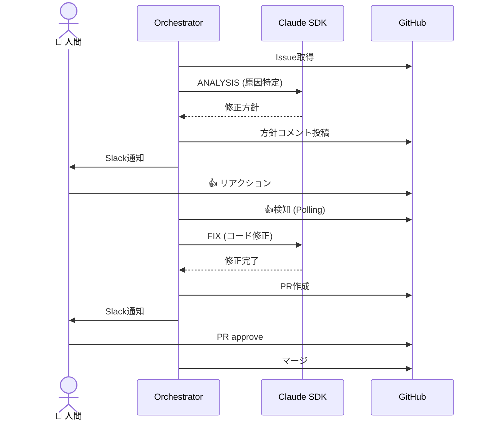
```mermaid
sequenceDiagram
    actor H as 🧑 人間
    participant O as Orchestrator
    participant AI as Claude SDK
    participant GH as GitHub

    O->>GH: Issue取得
    O->>AI: ANALYSIS (原因特定)
    AI-->>O: 修正方針
    O->>GH: 方針コメント投稿
    O->>H: Slack通知

    H->>GH: 👍 リアクション
    O->>GH: 👍検知 (Polling)

    O->>AI: FIX (コード修正)
    AI-->>O: 修正完了
    O->>GH: PR作成
    O->>H: Slack通知

    H->>GH: PR approve
    O->>GH: マージ
```

---

## 4. ⚡ Feature-S ワークフロー

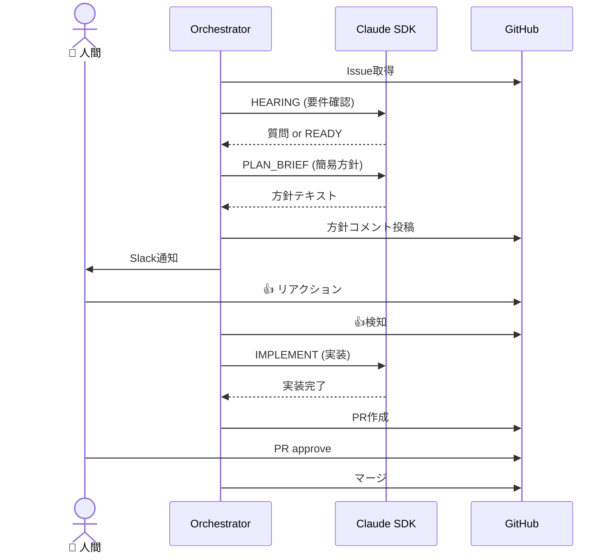
```mermaid
sequenceDiagram
    actor H as 🧑 人間
    participant O as Orchestrator
    participant AI as Claude SDK
    participant GH as GitHub

    O->>GH: Issue取得
    O->>AI: HEARING (要件確認)
    AI-->>O: 質問 or READY

    O->>AI: PLAN_BRIEF (簡易方針)
    AI-->>O: 方針テキスト
    O->>GH: 方針コメント投稿
    O->>H: Slack通知

    H->>GH: 👍 リアクション
    O->>GH: 👍検知

    O->>AI: IMPLEMENT (実装)
    AI-->>O: 実装完了
    O->>GH: PR作成

    H->>GH: PR approve
    O->>GH: マージ
```

---

## 5. 🏗️ Feature-M ワークフロー

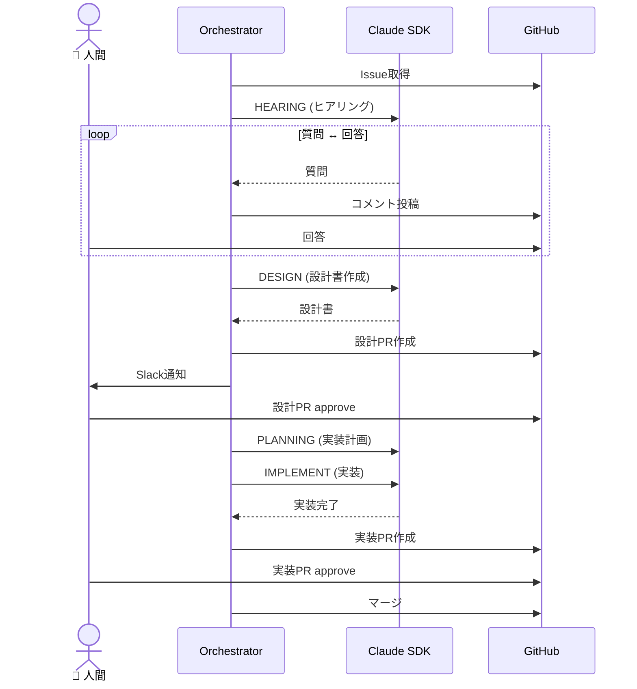
```mermaid
sequenceDiagram
    actor H as 🧑 人間
    participant O as Orchestrator
    participant AI as Claude SDK
    participant GH as GitHub

    O->>GH: Issue取得
    O->>AI: HEARING (ヒアリング)
    loop 質問 ↔ 回答
        AI-->>O: 質問
        O->>GH: コメント投稿
        H->>GH: 回答
    end

    O->>AI: DESIGN (設計書作成)
    AI-->>O: 設計書
    O->>GH: 設計PR作成
    O->>H: Slack通知

    H->>GH: 設計PR approve

    O->>AI: PLANNING (実装計画)
    O->>AI: IMPLEMENT (実装)
    AI-->>O: 実装完了
    O->>GH: 実装PR作成

    H->>GH: 実装PR approve
    O->>GH: マージ
```

---

## 6. 方針承認フロー比較

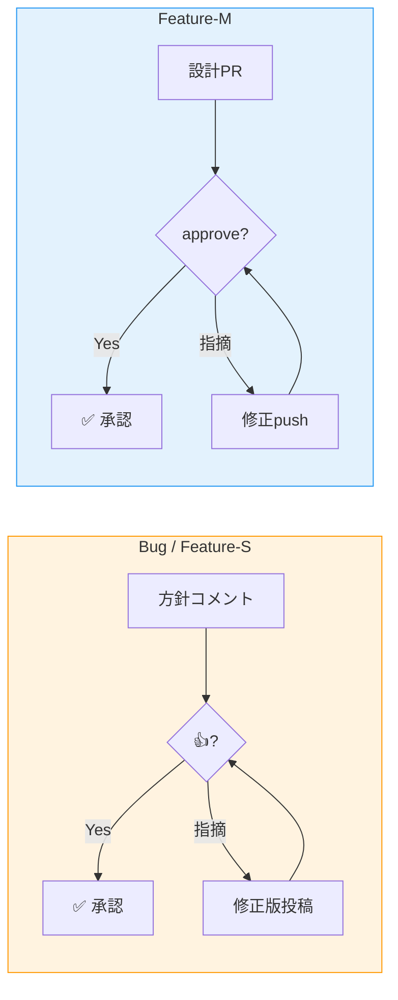
```mermaid
flowchart LR
    subgraph A["Bug / Feature-S"]
        direction TB
        A1["方針コメント"] --> A2{"👍?"}
        A2 -->|Yes| A3["✅ 承認"]
        A2 -->|指摘| A4["修正版投稿"] --> A2
    end

    subgraph B["Feature-M"]
        direction TB
        B1["設計PR"] --> B2{"approve?"}
        B2 -->|Yes| B3["✅ 承認"]
        B2 -->|指摘| B4["修正push"] --> B2
    end

    style A fill:#fff3e0,stroke:#ff9800
    style B fill:#e3f2fd,stroke:#2196f3
```

---

## 7. フェーズ遷移（State Machine）

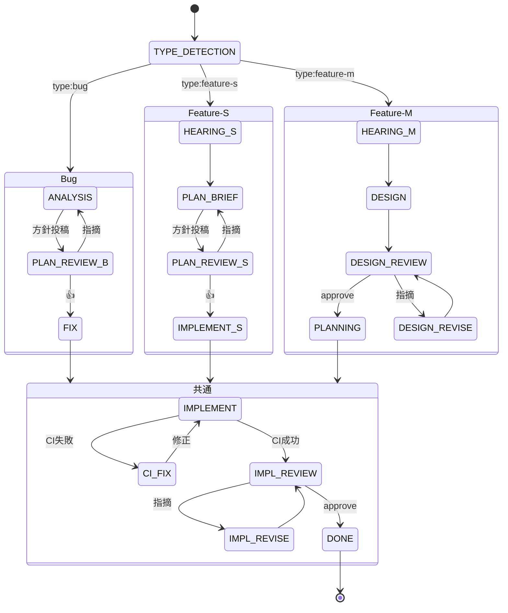
```mermaid
stateDiagram-v2
    [*] --> TYPE_DETECTION

    state "Bug" as bug {
        ANALYSIS --> PLAN_REVIEW_B: 方針投稿
        PLAN_REVIEW_B --> FIX: 👍
        PLAN_REVIEW_B --> ANALYSIS: 指摘
    }

    state "Feature-S" as fs {
        HEARING_S --> PLAN_BRIEF
        PLAN_BRIEF --> PLAN_REVIEW_S: 方針投稿
        PLAN_REVIEW_S --> IMPLEMENT_S: 👍
        PLAN_REVIEW_S --> PLAN_BRIEF: 指摘
    }

    state "Feature-M" as fm {
        HEARING_M --> DESIGN
        DESIGN --> DESIGN_REVIEW
        DESIGN_REVIEW --> PLANNING: approve
        DESIGN_REVIEW --> DESIGN_REVISE: 指摘
        DESIGN_REVISE --> DESIGN_REVIEW
    }

    TYPE_DETECTION --> bug: type:bug
    TYPE_DETECTION --> fs: type:feature-s
    TYPE_DETECTION --> fm: type:feature-m

    state "共通" as common {
        IMPLEMENT --> CI_FIX: CI失敗
        CI_FIX --> IMPLEMENT: 修正
        IMPLEMENT --> IMPL_REVIEW: CI成功
        IMPL_REVIEW --> IMPL_REVISE: 指摘
        IMPL_REVISE --> IMPL_REVIEW
        IMPL_REVIEW --> DONE: approve
    }

    FIX --> common
    IMPLEMENT_S --> common
    PLANNING --> common

    DONE --> [*]
```

---

## 8. Polling サイクル

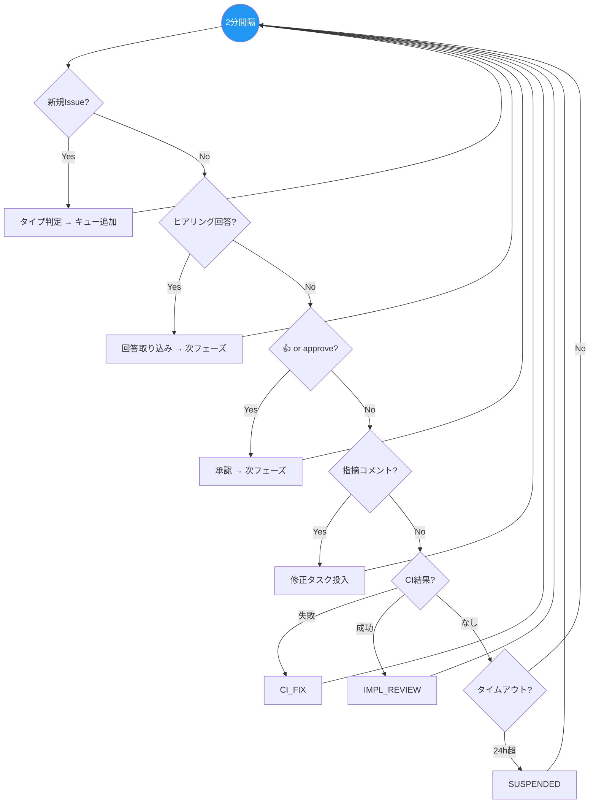
```mermaid
flowchart TB
    Start(("2分間隔")) --> P1{"新規Issue?"}
    P1 -->|Yes| P1a["タイプ判定 → キュー追加"]
    P1 -->|No| P2

    P2{"ヒアリング回答?"}
    P2 -->|Yes| P2a["回答取り込み → 次フェーズ"]
    P2 -->|No| P3

    P3{"👍 or approve?"}
    P3 -->|Yes| P3a["承認 → 次フェーズ"]
    P3 -->|No| P4

    P4{"指摘コメント?"}
    P4 -->|Yes| P4a["修正タスク投入"]
    P4 -->|No| P5

    P5{"CI結果?"}
    P5 -->|失敗| P5a["CI_FIX"]
    P5 -->|成功| P5b["IMPL_REVIEW"]
    P5 -->|なし| P6

    P6{"タイムアウト?"}
    P6 -->|24h超| P6a["SUSPENDED"]
    P6 -->|No| Start

    P1a --> Start
    P2a --> Start
    P3a --> Start
    P4a --> Start
    P5a --> Start
    P5b --> Start
    P6a --> Start

    style Start fill:#2196f3,color:#fff
```

---

## 9. 並行処理（Task Queue）

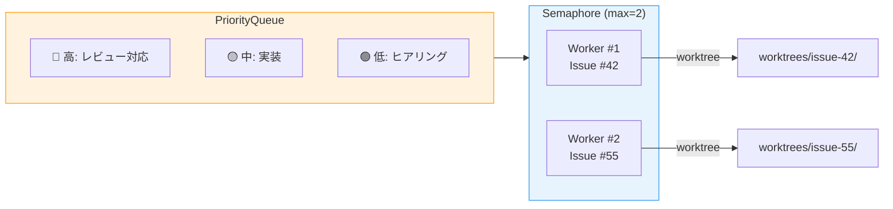
```mermaid
flowchart LR
    subgraph Queue["PriorityQueue"]
        T1["🔴 高: レビュー対応"]
        T2["🟡 中: 実装"]
        T3["🟢 低: ヒアリング"]
    end

    subgraph Sem["Semaphore (max=2)"]
        W1["Worker #1<br/>Issue #42"]
        W2["Worker #2<br/>Issue #55"]
    end

    Queue --> Sem

    W1 -->|worktree| WT1["worktrees/issue-42/"]
    W2 -->|worktree| WT2["worktrees/issue-55/"]

    style Queue fill:#fff3e0,stroke:#ff9800
    style Sem fill:#e8f4fd,stroke:#2196f3
```

---

## 10. エラーハンドリング

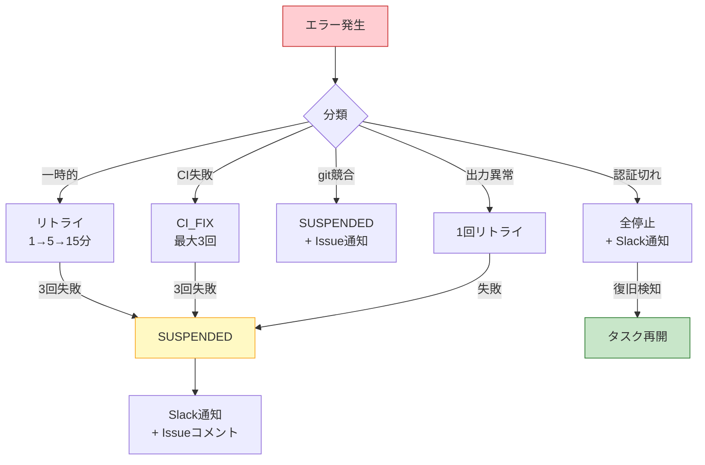
```mermaid
flowchart TB
    Error["エラー発生"] --> Classify{"分類"}

    Classify -->|一時的| Retry["リトライ<br/>1→5→15分"]
    Classify -->|認証切れ| Auth["全停止<br/>+ Slack通知"]
    Classify -->|git競合| Conflict["SUSPENDED<br/>+ Issue通知"]
    Classify -->|CI失敗| CILoop["CI_FIX<br/>最大3回"]
    Classify -->|出力異常| Once["1回リトライ"]

    Retry -->|3回失敗| Suspend["SUSPENDED"]
    Auth -->|復旧検知| Resume["タスク再開"]
    CILoop -->|3回失敗| Suspend
    Once -->|失敗| Suspend

    Suspend --> Notify["Slack通知<br/>+ Issueコメント"]

    style Error fill:#ffcdd2,stroke:#c62828
    style Suspend fill:#fff9c4,stroke:#f9a825
    style Resume fill:#c8e6c9,stroke:#2e7d32
```

---

## 11. モジュール構成

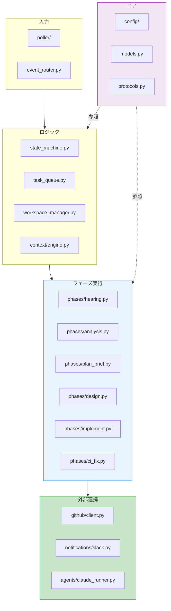
```mermaid
graph TB
    subgraph Core["コア"]
        Config["config/"]
        Models["models.py"]
        Protocols["protocols.py"]
    end

    subgraph Input["入力"]
        Poller["poller/"]
        Router["event_router.py"]
    end

    subgraph Logic["ロジック"]
        SM["state_machine.py"]
        TQ["task_queue.py"]
        WM["workspace_manager.py"]
        CE["context/engine.py"]
    end

    subgraph Phases["フェーズ実行"]
        PH["phases/hearing.py"]
        PA["phases/analysis.py"]
        PB["phases/plan_brief.py"]
        PD["phases/design.py"]
        PI["phases/implement.py"]
        PC["phases/ci_fix.py"]
    end

    subgraph External["外部連携"]
        GHC["github/client.py"]
        SL["notifications/slack.py"]
        CR["agents/claude_runner.py"]
    end

    Input --> Logic
    Logic --> Phases
    Phases --> External
    Core -.->|参照| Logic
    Core -.->|参照| Phases

    style Core fill:#f3e5f5,stroke:#9c27b0
    style Phases fill:#e8f4fd,stroke:#2196f3
    style External fill:#c8e6c9,stroke:#2e7d32
```

---

## 12. タイプ判定フロー

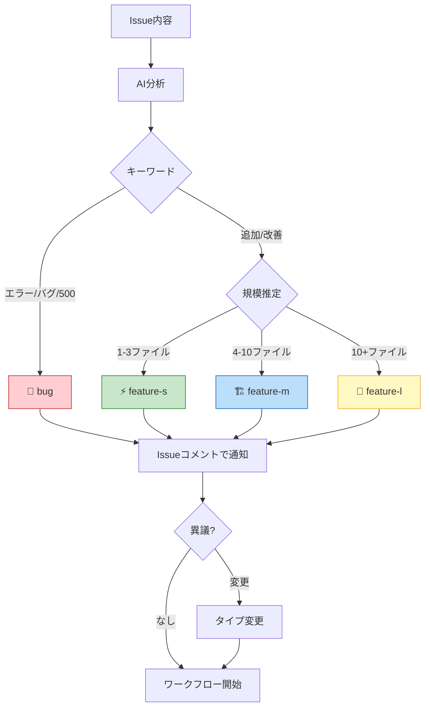
```mermaid
flowchart TB
    Issue["Issue内容"] --> AI["AI分析"]

    AI --> KW{"キーワード"}
    KW -->|"エラー/バグ/500"| Bug["🐛 bug"]
    KW -->|"追加/改善"| Size{"規模推定"}

    Size -->|"1-3ファイル"| FS["⚡ feature-s"]
    Size -->|"4-10ファイル"| FM["🏗️ feature-m"]
    Size -->|"10+ファイル"| FL["🏢 feature-l"]

    Bug & FS & FM & FL --> Notify["Issueコメントで通知"]
    Notify --> Wait{"異議?"}
    Wait -->|なし| Go["ワークフロー開始"]
    Wait -->|変更| Change["タイプ変更"] --> Go

    style Bug fill:#ffcdd2,stroke:#c62828
    style FS fill:#c8e6c9,stroke:#2e7d32
    style FM fill:#bbdefb,stroke:#1565c0
    style FL fill:#fff9c4,stroke:#f9a825
```

---

## 13. セットアップフロー

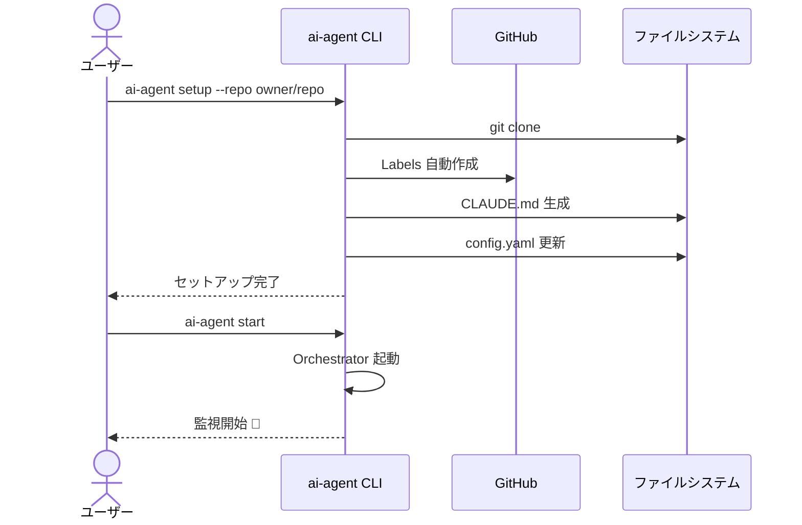
```mermaid
sequenceDiagram
    actor U as ユーザー
    participant CLI as ai-agent CLI
    participant GH as GitHub
    participant FS as ファイルシステム

    U->>CLI: ai-agent setup --repo owner/repo
    CLI->>FS: git clone
    CLI->>GH: Labels 自動作成
    CLI->>FS: CLAUDE.md 生成
    CLI->>FS: config.yaml 更新
    CLI-->>U: セットアップ完了

    U->>CLI: ai-agent start
    CLI->>CLI: Orchestrator 起動
    CLI-->>U: 監視開始 🚀
```

---

## 14. 技術スタック

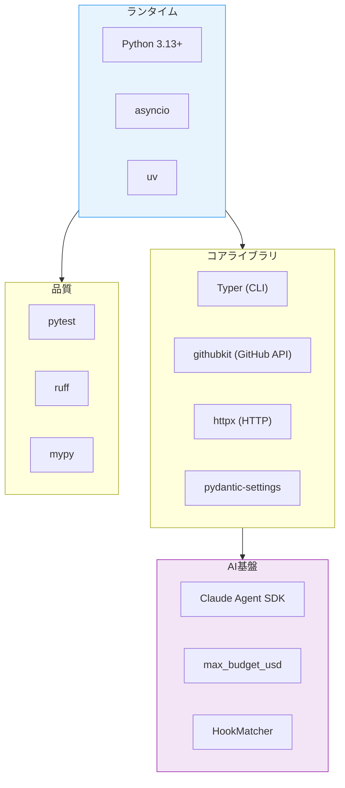
```mermaid
graph TB
    subgraph Runtime["ランタイム"]
        Py["Python 3.13+"]
        Async["asyncio"]
        UV["uv"]
    end

    subgraph Libs["コアライブラリ"]
        Typer["Typer (CLI)"]
        GHK["githubkit (GitHub API)"]
        HTTPX["httpx (HTTP)"]
        Pydantic["pydantic-settings"]
    end

    subgraph AI["AI基盤"]
        SDK["Claude Agent SDK"]
        Budget["max_budget_usd"]
        Hooks["HookMatcher"]
    end

    subgraph Quality["品質"]
        Pytest["pytest"]
        Ruff["ruff"]
        Mypy["mypy"]
    end

    Runtime --> Libs --> AI
    Runtime --> Quality

    style AI fill:#f3e5f5,stroke:#9c27b0
    style Runtime fill:#e8f4fd,stroke:#2196f3
```

---

## 15. コスト比較

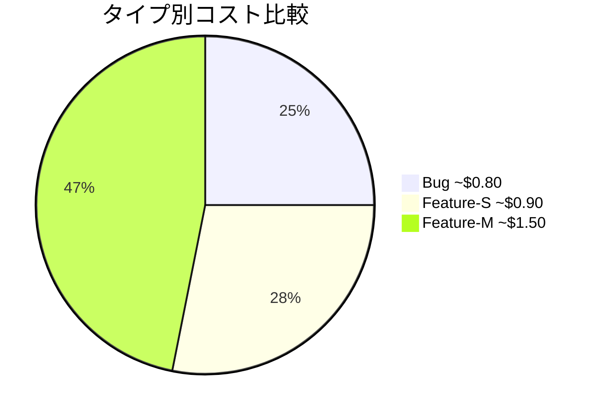
```mermaid
pie title タイプ別コスト比較
    "Bug ~$0.80" : 80
    "Feature-S ~$0.90" : 90
    "Feature-M ~$1.50" : 150
```

---

## 18. 自己改善ループ全体フロー

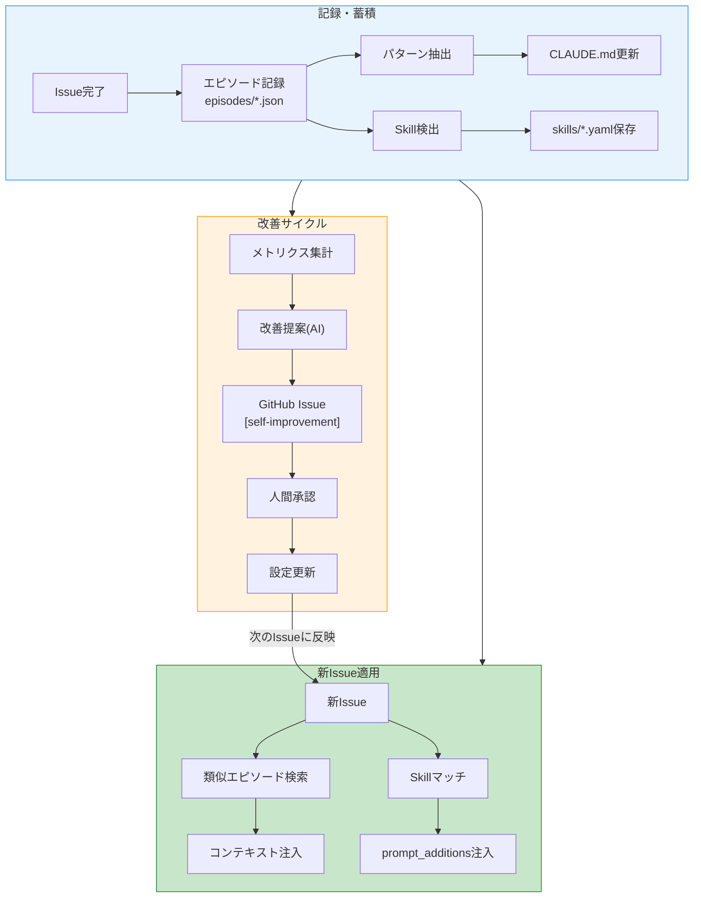
```mermaid
flowchart TB
    subgraph Record["記録・蓄積"]
        Done["Issue完了"] --> Ep["エピソード記録<br/>episodes/*.json"]
        Ep --> Pat["パターン抽出"]
        Pat --> CM["CLAUDE.md更新"]
        Ep --> SkDet["Skill検出"]
        SkDet --> SkSave["skills/*.yaml保存"]
    end

    subgraph Apply["新Issue適用"]
        New["新Issue"] --> Sim["類似エピソード検索"]
        Sim --> Ctx["コンテキスト注入"]
        New --> SkMatch["Skillマッチ"]
        SkMatch --> Prompt["prompt_additions注入"]
    end

    subgraph Improve["改善サイクル"]
        Metrics["メトリクス集計"] --> Suggest["改善提案(AI)"]
        Suggest --> GHI["GitHub Issue<br/>[self-improvement]"]
        GHI --> Human["人間承認"]
        Human --> Update["設定更新"]
    end

    Record --> Apply
    Record --> Improve
    Update -->|次のIssueに反映| New

    style Record fill:#e8f4fd,stroke:#2196f3
    style Apply fill:#c8e6c9,stroke:#2e7d32
    style Improve fill:#fff3e0,stroke:#ff9800
```

---

## 19. ナレッジ蓄積フロー

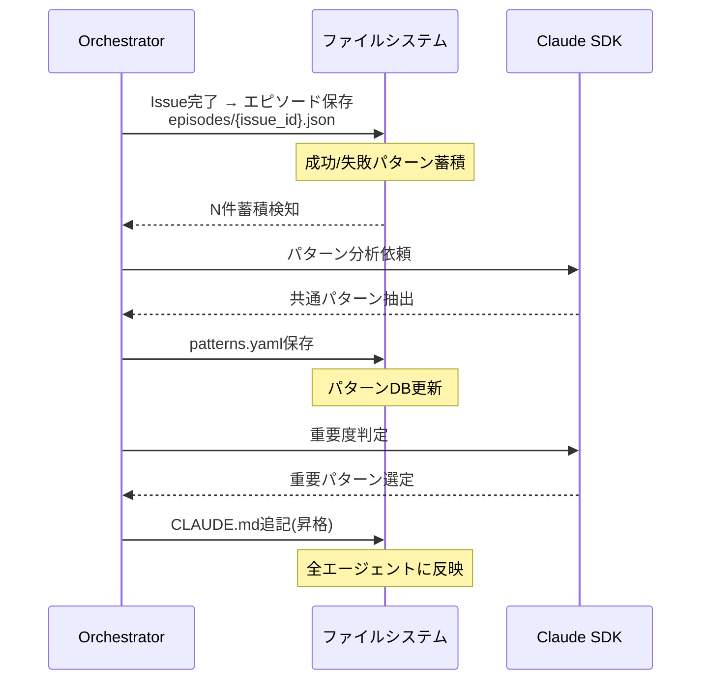
```mermaid
sequenceDiagram
    participant O as Orchestrator
    participant FS as ファイルシステム
    participant AI as Claude SDK

    O->>FS: Issue完了 → エピソード保存<br/>episodes/{issue_id}.json
    Note over FS: 成功/失敗パターン蓄積

    FS-->>O: N件蓄積検知
    O->>AI: パターン分析依頼
    AI-->>O: 共通パターン抽出

    O->>FS: patterns.yaml保存
    Note over FS: パターンDB更新

    O->>AI: 重要度判定
    AI-->>O: 重要パターン選定
    O->>FS: CLAUDE.md追記(昇格)
    Note over FS: 全エージェントに反映
```

---

## 20. Skill検出・適用フロー

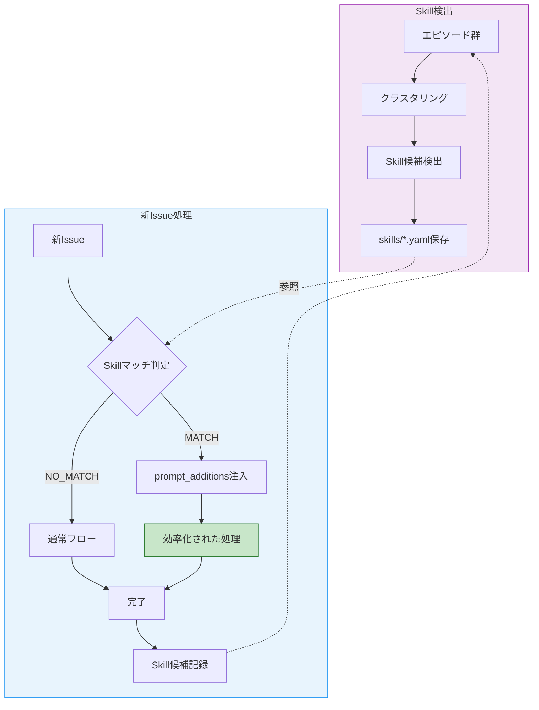
```mermaid
flowchart TB
    subgraph Detect["Skill検出"]
        Episodes["エピソード群"] --> Cluster["クラスタリング"]
        Cluster --> Candidate["Skill候補検出"]
        Candidate --> Save["skills/*.yaml保存"]
    end

    subgraph Match["新Issue処理"]
        New["新Issue"] --> Judge{"Skillマッチ判定"}
        Judge -->|MATCH| Inject["prompt_additions注入"]
        Inject --> Fast["効率化された処理"]
        Judge -->|NO_MATCH| Normal["通常フロー"]
        Normal --> Complete["完了"]
        Complete --> Record["Skill候補記録"]
        Record -.-> Episodes
    end

    Save -.->|参照| Judge
    Fast --> Complete

    style Detect fill:#f3e5f5,stroke:#9c27b0
    style Match fill:#e8f4fd,stroke:#2196f3
    style Fast fill:#c8e6c9,stroke:#2e7d32
```

---

## 21. メトリクス・改善サイクル

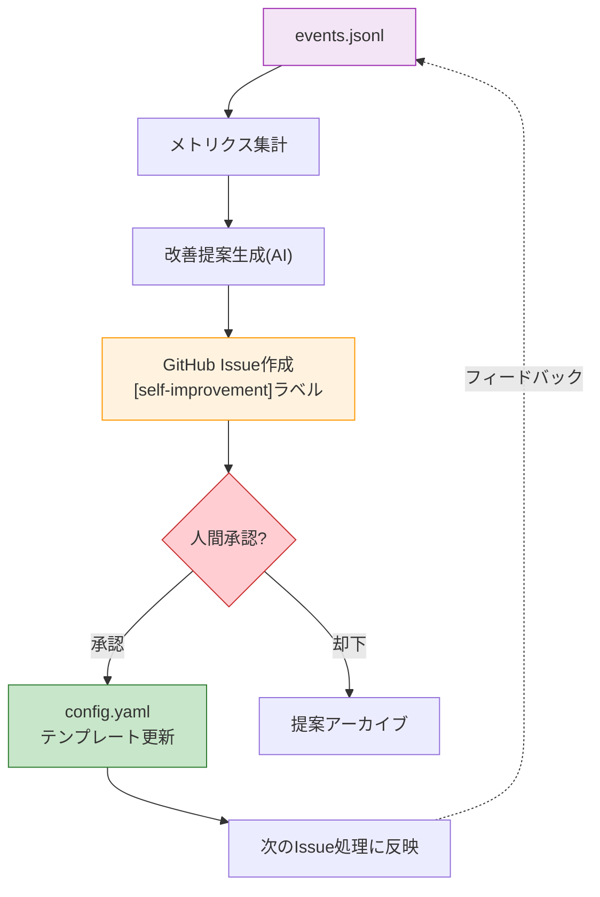
```mermaid
flowchart TB
    Events["events.jsonl"] --> Agg["メトリクス集計"]

    Agg --> AI["改善提案生成(AI)"]
    AI --> GHI["GitHub Issue作成<br/>[self-improvement]ラベル"]

    GHI --> Human{"人間承認?"}
    Human -->|承認| Update["config.yaml<br/>テンプレート更新"]
    Human -->|却下| Archive["提案アーカイブ"]

    Update --> Next["次のIssue処理に反映"]
    Next -.->|フィードバック| Events

    style Events fill:#f3e5f5,stroke:#9c27b0
    style GHI fill:#fff3e0,stroke:#ff9800
    style Human fill:#ffcdd2,stroke:#c62828
    style Update fill:#c8e6c9,stroke:#2e7d32
```

---

## 22. トークン解決フロー (CredentialResolver)

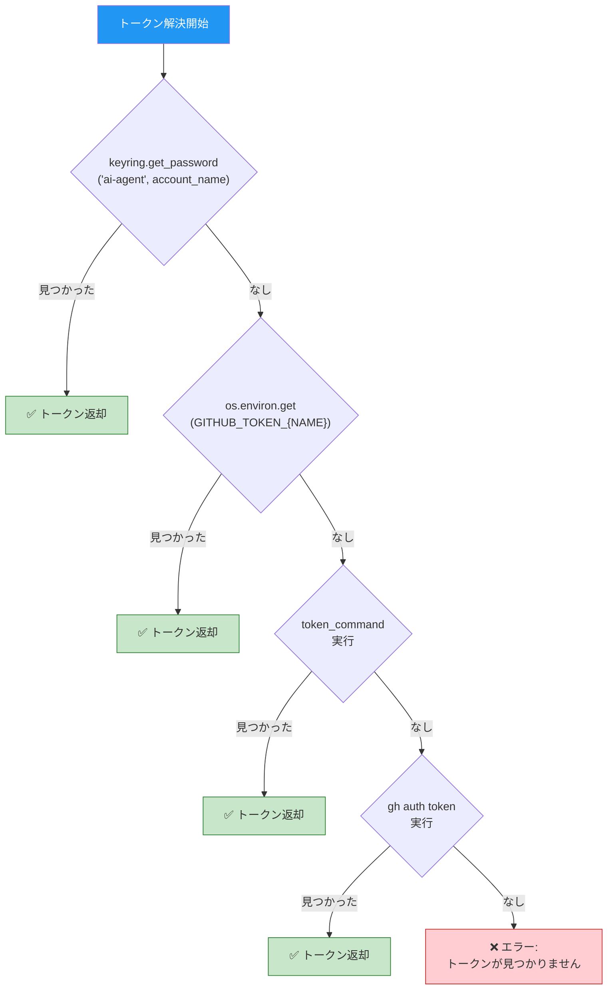
```mermaid
flowchart TB
    Start["トークン解決開始"] --> K{"keyring.get_password<br/>('ai-agent', account_name)"}

    K -->|見つかった| KR["✅ トークン返却"]
    K -->|なし| E{"os.environ.get<br/>(GITHUB_TOKEN_{NAME})"}

    E -->|見つかった| ER["✅ トークン返却"]
    E -->|なし| C{"token_command<br/>実行"}

    C -->|見つかった| CR["✅ トークン返却"]
    C -->|なし| G{"gh auth token<br/>実行"}

    G -->|見つかった| GR["✅ トークン返却"]
    G -->|なし| Fail["❌ エラー:<br/>トークンが見つかりません"]

    style Start fill:#2196f3,color:#fff
    style KR fill:#c8e6c9,stroke:#2e7d32
    style ER fill:#c8e6c9,stroke:#2e7d32
    style CR fill:#c8e6c9,stroke:#2e7d32
    style GR fill:#c8e6c9,stroke:#2e7d32
    style Fail fill:#ffcdd2,stroke:#c62828
```

---

## 23. セットアップフロー (7ステップ)

```mermaid
flowchart TB
    Start(("setup開始")) --> S1["Step 1: アカウント検証<br/>トークン確認・API疎通"]
    S1 --> S2["Step 2: リポジトリ<br/>clone / pull更新"]
    S2 --> S3{"Step 3: CLAUDE.md"}

    S3 -->|存在する| S3a["既存ファイル使用"]
    S3 -->|存在しない| S3b["自動検出 → 生成"]
    S3a --> S4
    S3b --> S4

    S4{"Step 4: ラベル作成"}
    S4 -->|デフォルト| S4a["8個 (基本ラベル)"]
    S4 -->|フル| S4b["25個 (全ラベル)"]
    S4a --> S5
    S4b --> S5

    S5["Step 5: ディレクトリ初期化<br/>knowledge/ skills/ logs/"]
    S5 --> S6["Step 6: config.yaml更新<br/>リポジトリ・アカウント登録"]
    S6 --> S7["Step 7: 検証サマリー表示"]
    S7 --> Done["✅ セットアップ完了"]

    style Start fill:#2196f3,color:#fff
    style Done fill:#4caf50,color:#fff
    style S3 fill:#fff3e0,stroke:#ff9800
    style S4 fill:#fff3e0,stroke:#ff9800
```

---

## 24. 複数アカウント管理

```mermaid
graph TB
    subgraph AM["AccountManager"]
        direction TB
        AM_Core["アカウント一覧管理<br/>get_client(account_name)"]
    end

    AM_Core --> C1["GitHubClient<br/>(personal)"]
    AM_Core --> C2["GitHubClient<br/>(work)"]

    C1 -->|トークン| T1["CredentialResolver<br/>personalトークン"]
    C2 -->|トークン| T2["CredentialResolver<br/>workトークン"]

    subgraph Repos["リポジトリ → アカウント対応"]
        R1["owner/repo-a"] -.->|account: personal| C1
        R2["company/repo-b"] -.->|account: work| C2
        R3["company/repo-c"] -.->|account: work| C2
    end

    subgraph Polling["Poller"]
        P["Polling処理"] -->|リポジトリごとに<br/>対応クライアント取得| AM_Core
    end

    style AM fill:#e8f4fd,stroke:#2196f3
    style Repos fill:#fff3e0,stroke:#ff9800
    style Polling fill:#f3e5f5,stroke:#9c27b0
```
