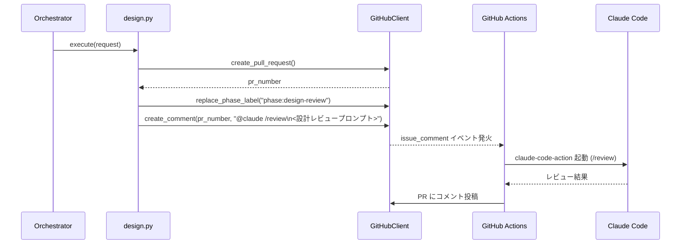
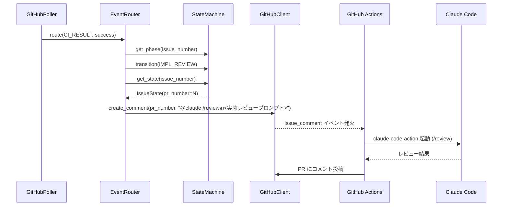

# Issue #65 設計書: claudeの/reviewを使えるようにしたい

## 1. 概要

Claude Code の `/review` コマンドを PR レビューに活用できるようにする。

具体的には以下の2点を実現する。

1. **`@claude /review` トリガーワークフローの新設**
   PR コメントで `@claude /review` を検知し、GitHub Actions 上で Claude Code を起動してレビュー結果をコメント投稿する新しいワークフロー (`.github/workflows/claude-review.yml`) を追加する。

2. **自動コメント投稿**
   オーケストレーターが各フェーズ遷移時に `@claude /review` コメントを PR へ自動投稿し、レビューを自動起動する。
   - **Feature-M 設計 PR (DESIGN_REVIEW フェーズ)**: `design.py` の `process_result()` で設計 PR 作成直後に投稿
   - **全ワークフロー 実装 PR (IMPL_REVIEW フェーズ)**: `event_router.py` の `_handle_ci_result()` で CI パス後に投稿

---

## 2. アーキテクチャ

### 2.1 全体フロー

```
【設計PRの場合 (Feature-M のみ)】

 design.py::process_result()
   → PR 作成
   → DESIGN_REVIEW 遷移
   → GitHubClient.create_comment(pr_number, "@claude /review\n<設計レビュープロンプト>")
        ↓
   GitHub Actions (claude-review.yml) が issue_comment イベントを検知
        ↓
   Claude Code が /review を実行
        ↓
   レビュー結果を PR コメントに投稿


【実装PRの場合 (Bug / Feature-M 全て)】

 implement.py::_finalize()
   → PR 作成
   → IMPL_REVIEW 遷移

 event_router.py::_handle_ci_result() [ci_status == "success"]
   → IMPL_REVIEW 遷移 (まだの場合)
   → GitHubClient.create_comment(pr_number, "@claude /review\n<実装レビュープロンプト>")
        ↓
   GitHub Actions (claude-review.yml) が issue_comment イベントを検知
        ↓
   Claude Code が /review を実行
        ↓
   レビュー結果を PR コメントに投稿
```

### 2.2 フェーズ別の自動コメント投稿タイミング

| フェーズ | 投稿タイミング | 投稿場所 | 対象ワークフロー |
|---------|--------------|---------|----------------|
| DESIGN_REVIEW | `design.py::process_result()` 内、DESIGN_REVIEW 遷移直後 | 設計 PR | Feature-M のみ |
| IMPL_REVIEW | `event_router.py::_handle_ci_result()` 内、CI success 検知時 | 実装 PR | Bug / Feature-M |

---

## 3. 変更ファイル一覧

| ファイル | 変更種別 | 概要 |
|---------|---------|------|
| `.github/workflows/claude-review.yml` | **新規** | `@claude /review` を検知して Claude Code を実行するワークフロー |
| `src/ai_agent_orchestrator/phases/design.py` | **変更** | `process_result()` に設計レビュー用 `@claude /review` コメント投稿を追加 |
| `src/ai_agent_orchestrator/poller/event_router.py` | **変更** | `_handle_ci_result()` の CI success パスに実装レビュー用 `@claude /review` コメント投稿を追加 |

---

## 4. 実装詳細

### 4.1 `.github/workflows/claude-review.yml` (新規)

PR コメントで `@claude /review` が投稿されたことを検知し、`anthropics/claude-code-action@beta` を使って Claude Code を起動する。

```yaml
name: Claude Code Review

on:
  issue_comment:
    types: [created]

concurrency:
  group: claude-review-${{ github.event.issue.number }}
  cancel-in-progress: false

jobs:
  claude-review:
    # PRコメントかつ @claude /review を含む場合のみ実行
    # ボットコメントは除外し、無限ループを防ぐ
    if: |
      github.event.issue.pull_request != null &&
      contains(github.event.comment.body, '@claude /review') &&
      github.event.comment.user.type != 'Bot'
    runs-on: ubuntu-latest
    permissions:
      contents: read
      pull-requests: write
    steps:
      - uses: actions/checkout@v4
        with:
          fetch-depth: 0

      - uses: anthropics/claude-code-action@v1
        with:
          claude_code_oauth_token: ${{ secrets.CLAUDE_CODE_OAUTH_TOKEN }}
```

**ポイント**:
- `github.event.issue.pull_request != null` で PR コメントのみに限定し、Issue コメントでの誤発火を防ぐ
- `github.event.comment.user.type != 'Bot'` でボットのコメントを除外し、Claude Code が投稿したレビュー結果に `/review` の文言が含まれていても再起動しないようにする
- `concurrency` グループを PR 番号で設定し、同一 PR での並列レビュー実行を防ぐ。`cancel-in-progress: false` としてレビュー完了を保証する
- `issues: write` 権限は PR コメント投稿には不要なため削除し、最小権限の原則に従う
- `anthropics/claude-code-action@v1` とバージョンを固定し、`@beta` タグの変更による予期せぬ挙動変化・サプライチェーンリスクを回避する
- `fetch-depth: 0` で PR の全差分を取得可能にする
- `CLAUDE_CODE_OAUTH_TOKEN` はリポジトリシークレットとして設定が必要 (セクション 6 参照)

### 4.2 `phases/design.py` の変更

`process_result()` で DESIGN_REVIEW 遷移後に `@claude /review` コメントを設計 PR へ投稿する。

**変更箇所: `process_result()` 末尾に追記**

```python
async def process_result(self, request: TaskRequest, result: AgentResult) -> None:
    # ... (既存処理) ...

    # DESIGN_REVIEW 遷移後に @claude /review を自動投稿
    await self._post_design_review_comment(request, pr_number)


async def _post_design_review_comment(
    self,
    request: TaskRequest,
    pr_number: int,
) -> None:
    """設計PRに @claude /review コメントを投稿する。

    Args:
        request: タスクリクエスト。
        pr_number: 設計 PR 番号。
    """
    body = _DESIGN_REVIEW_PROMPT
    try:
        client = await self._get_client(request.repo)
        await client.create_comment(request.repo, pr_number, body)
        logger.info(
            "Issue #%d: posted @claude /review comment to design PR #%d",
            request.issue_number,
            pr_number,
        )
    except Exception:
        logger.warning(
            "Issue #%d: failed to post @claude /review to design PR #%d",
            request.issue_number,
            pr_number,
            exc_info=True,
        )
```

**定数 `_DESIGN_REVIEW_PROMPT`** (ファイル先頭に定義):

```python
_DESIGN_REVIEW_PROMPT = """\
@claude /review

## レビュー観点（設計レビュー）

以下の観点でこのPRの設計書をレビューしてください。

### チェック項目
- **Issue要件との整合性**: Issueで要求された機能・仕様が設計書に網羅されているか
- **設計の完全性・一貫性**: フェーズ遷移、データフロー、エラーハンドリングが設計書に明記されているか
- **CLAUDE.md規約との整合性**: Protocol ベース設計、非同期設計、型アノテーション方針との整合性
- **実装上の潜在的問題**: 依存関係の見落とし、循環参照、テスタビリティの問題
- **テスト方針の妥当性**: TDD の観点でテスト戦略が適切か
"""
```

### 4.3 `poller/event_router.py` の変更

`_handle_ci_result()` の CI success パスで、`@claude /review` コメントを実装 PR へ投稿する。

**変更箇所: `_handle_ci_result()` の `ci_status == "success"` ブロック**

```python
elif ci_status == "success":
    current = self._sm.get_phase(event.issue.number)
    if current != Phase.IMPL_REVIEW:
        await self._sm.transition(event.issue.number, Phase.IMPL_REVIEW)
        # フェーズ遷移が実際に発生した場合のみ @claude /review を投稿（冪等性保証）
        await self._post_impl_review_comment(event)
    # current == Phase.IMPL_REVIEW の場合（CI が再度 success を発火した等）は
    # 既にレビュー済みのため投稿をスキップする


async def _post_impl_review_comment(self, event: PollEvent) -> None:
    """CI パス後に実装PRへ @claude /review コメントを投稿する。

    Args:
        event: CI 結果イベント。
    """
    assert event.issue is not None
    try:
        state = self._sm.get_state(event.issue.number)
        if state is None or state.pr_number is None:
            logger.warning(
                "Issue #%d: pr_number not found in state, skipping @claude /review",
                event.issue.number,
            )
            return

        client = await self._get_client(event.repo)
        if client is None:
            return

        await client.create_comment(event.repo, state.pr_number, _IMPL_REVIEW_PROMPT)
        logger.info(
            "Issue #%d: posted @claude /review comment to impl PR #%d",
            event.issue.number,
            state.pr_number,
        )
    except Exception:
        logger.warning(
            "Issue #%d: failed to post @claude /review to impl PR",
            event.issue.number,
            exc_info=True,
        )
```

**定数 `_IMPL_REVIEW_PROMPT`** (ファイル先頭に定義):

```python
_IMPL_REVIEW_PROMPT = """\
@claude /review

## レビュー観点（実装レビュー）

以下の観点でこのPRの実装をレビューしてください。

### チェック項目
- **バグ・潜在的なバグ（最重要）**: ロジックエラー、エッジケース、競合状態、None 参照
- **コード品質・可読性**: 関数分割、命名、複雑度
- **設計品質**: 責務分離、Protocol 準拠、依存関係の適切さ
- **セキュリティ**: 認証・認可、入力検証、シークレット漏洩リスク
- **CLAUDE.md規約との整合性**:
  - mypy strict モード準拠（全関数に型アノテーション）
  - async/await の正しい使用（ブロッキング呼び出し禁止）
  - docstring（クラスと公開メソッドに必須、Google style）
  - 具体的な例外クラスの使用（裸の `except:` 禁止）
- **テストカバレッジ**: 境界値・異常系のテストが充足しているか
"""
```

---

## 5. シーケンス図

### 5.1 設計レビュー自動起動 (Feature-M)



### 5.2 実装レビュー自動起動 (全ワークフロー)



---

## 6. 必要な設定

### 6.1 GitHub Actions シークレット

リポジトリの Settings → Secrets and variables → Actions に以下を追加する。

| シークレット名 | 値 | 説明 |
|-------------|---|------|
| `CLAUDE_CODE_OAUTH_TOKEN` | Claude Code OAuth トークン | Claude Code の認証に使用 |

### 6.2 GitHub Actions 権限

`.github/workflows/claude-review.yml` に以下の権限が必要。

```yaml
permissions:
  contents: read       # リポジトリのコードを読む
  pull-requests: write # PR にコメントを投稿する
```

---

## 7. エラーハンドリング方針

`@claude /review` コメント投稿失敗はレビューの副次機能であり、フェーズ遷移自体は止めない。

- コメント投稿失敗時は `logger.warning` でログを残し、例外を握り潰す
- これにより、コメント投稿が失敗しても既存のフェーズ遷移フローに影響しない
- GitHub Actions ワークフロー側の失敗は GitHub Actions の UI で確認可能

### 冪等性保証

`@claude /review` コメントの重複投稿を防ぐため、以下の方針を採用する。

- **`event_router.py`**: `IMPL_REVIEW` へのフェーズ遷移が実際に発生した場合（`current != Phase.IMPL_REVIEW`）のみ `_post_impl_review_comment` を呼び出す。CI success イベントが複数回発火しても、フェーズが既に `IMPL_REVIEW` であればスキップする。
- **`claude-review.yml`**: `github.event.comment.user.type != 'Bot'` 条件でボットコメントを除外し、Claude Code のレビュー結果コメントが `/review` 文言を含んでいても再起動しないようにする。また `concurrency` グループで同一 PR での並列レビュー実行を防ぐ。

---

## 8. テスト計画

### 8.1 単体テスト

#### `tests/unit/test_phases.py` への追加

- `DesignExecutor.process_result()` が `@claude /review` コメントを `create_comment` で投稿することを確認
- コメント投稿失敗時も DESIGN_REVIEW 遷移が完了することを確認

#### `tests/unit/test_event_router.py` への追加

- `_handle_ci_result()` の `ci_status == "success"` 時に `@claude /review` コメントを投稿することを確認
- CI success イベントが2回来た場合に `create_comment` が1回のみ呼ばれることを確認（冪等性テスト）
- 既に `IMPL_REVIEW` 状態で CI success が来た場合、コメント投稿がスキップされることを確認
- `state.pr_number` が None の場合はスキップされることを確認
- コメント投稿失敗時も IMPL_REVIEW 遷移が完了することを確認
- 既存の `test_ci_success_routes_to_impl_review` テストを `create_comment` モックを追加して更新する

### 8.2 GitHub Actions ワークフローの確認

- PR にコメント `@claude /review` を手動投稿してワークフローが起動することを確認
- Issue コメントでは起動しないことを確認 (`issue.pull_request` フィルタ)
- Claude Code のレビュー結果が PR コメントとして返ってくることを確認

---

## 9. 影響範囲

| モジュール | 影響 | 理由 |
|----------|------|------|
| `design.py` | 軽微 | `process_result()` 末尾に非同期コメント投稿を追加するのみ |
| `event_router.py` | 軽微 | CI success パスに非同期コメント投稿を追加するのみ |
| `github/client.py` | なし | 既存の `create_comment()` をそのまま使用 (PRはGitHub API上はIssueとして扱われる) |
| `models.py` | なし | 変更不要 |
| `orchestrator.py` | なし | 変更不要 |

---

## 10. 補足

### `create_comment()` の再利用について

GitHub API では PR はゼロから `issue_comment` として扱われるため、既存の `GitHubClient.create_comment(repo, pr_number, body)` を `pr_number` に対してそのまま呼び出すことで PR コメントを投稿できる。新規メソッドの追加は不要。

### `@claude /review` コメントのフォーマット

コメント本文に続く観点テキストは Claude Code が読み込み、`/review` コマンドの追加コンテキストとして扱われる。これにより設計レビューと実装レビューで異なるレビュー観点をプロンプトとして指定できる。

### IMPL_REVIEW への遷移パス

`IMPL_REVIEW` へは2つのパスがある：
1. `implement._finalize()` → PR 作成直後に遷移（CI はまだ未実施）
2. `event_router._handle_ci_result()` → CI success 後に遷移

本設計では CI パス後の品質保証を重視し、パス②（CI success 時）に `@claude /review` を投稿する方針を採用する。CI がスキップされる場合（例: 設定変更のみのPR）はパス①で遷移するが、その場合は手動で `@claude /review` を投稿することで対応する。
