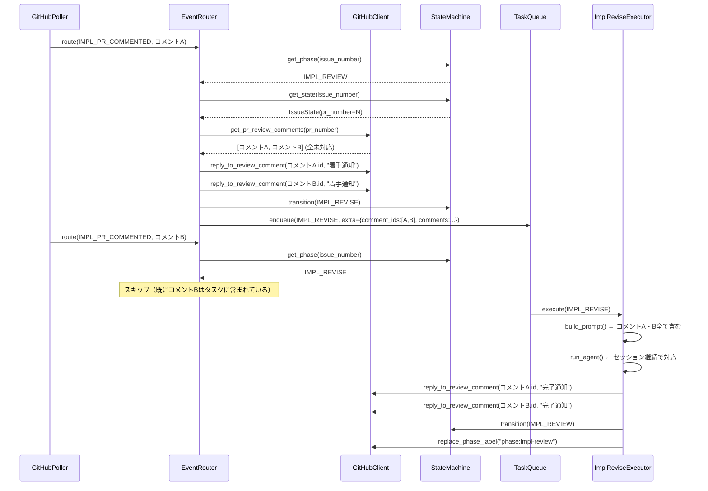

# Issue #69 設計書: レビュー指摘コメントを複数同時にコメントしても全てに適切に対応できるようにする

## 1. 概要

PRのレビュー指摘コメントが複数同時に投稿された場合でも、全指摘に漏れなく対応できるようにする。
また、各レビューコメントのスレッドに「着手通知」と「完了通知」を直接返信する機能を追加する。

### ヒアリング回答まとめ

| 質問 | 回答 |
|-----|-----|
| Q1: 返信先 | PRのレビューコメントスレッド内にreply（`pulls.create_reply_for_review_comment` API使用） |
| Q2: 複数コメントの処理戦略 | 全件まとめて1回のIMPL_REVISEで対応（ポーリング時に全未対応コメントを収集） |
| Q3: 返信タイミング | 両方：着手通知（検知時）＋完了通知（revise完了後）の2回 |

---

## 2. 現状の問題点

### 問題1: IMPL_REVISE中に到着したコメントが無視される

`event_router.py::_handle_impl_pr_commented` の以下の処理が原因：

```python
if current_phase == Phase.IMPL_REVISE:
    logger.info(
        "Issue #%d is already in impl-revise, skipping duplicate PR comment",
        event.issue.number,
    )
    return  # ← 後発コメントが完全に無視される（バグ）
```

複数のレビュアーが同時にコメントした場合：
1. コメントAで `IMPL_PR_COMMENTED` イベント発火 → `IMPL_REVISE` 遷移・エンキュー
2. コメントBで `IMPL_PR_COMMENTED` イベント発火 → `IMPL_REVISE` 中のためスキップ ❌

### 問題2: PRレビューコメントへの返信APIが存在しない

`github/client.py` には Issue コメントを新規投稿する `create_comment` しか存在せず、
PRのレビューコメントスレッド内に返信する API ラッパーが未実装。

---

## 3. 解決方針

### 方針A: 全件まとめて収集（問題1の解決）

`IMPL_PR_COMMENTED` イベント処理時に、イベントの `extra["comments"]` だけを見るのではなく、
**GitHub API で PR の全未対応レビューコメントを都度取得**する。

これにより：
- コメントAのイベント処理時点で、コメントBもすでに存在していれば両方まとめて取得できる
- `IMPL_REVISE` 中のスキップ処理を維持しつつ、先発イベントが全コメントを包含することで対応漏れを防ぐ

### 方針B: スレッド返信API追加（問題2の解決）

`github/client.py` に `reply_to_review_comment()` メソッドを追加し、
GitHub API `POST /repos/{owner}/{repo}/pulls/{pull_number}/comments/{comment_id}/replies`
を呼び出せるようにする。

### 方針C: 2段階通知（着手通知＋完了通知）

- **着手通知**（`event_router` 内、`IMPL_REVISE` 遷移時）: 各レビューコメントへ即座に返信
- **完了通知**（`impl_revise.process_result` 内、revise完了後）: 各レビューコメントへ修正完了を返信

---

## 4. アーキテクチャ

### 4.1 全体フロー（修正後）

```
【複数レビューコメント同時到着の場合】

ポーリング周期N:
  GitHub API: レビュアーAがコメントA, レビュアーBがコメントBを同時に投稿

  event_router._handle_impl_pr_commented (コメントAイベント):
    1. PR の全未対応レビューコメントを取得 [コメントA, コメントB]
    2. 各コメントに着手通知返信: "レビュー指摘を確認しました。修正を開始します。"
    3. IMPL_REVIEW → IMPL_REVISE 遷移
    4. TaskQueue に IMPL_REVISE エンキュー (extra: {comment_ids: [A.id, B.id], comments: "..."})

  event_router._handle_impl_pr_commented (コメントBイベント):
    5. 現在のフェーズ == IMPL_REVISE → スキップ (コメントBはAのタスクに含まれているため問題なし)

  impl_revise.build_prompt:
    6. コメントA・Bを含むプロンプトを構築

  impl_revise.run_agent:
    7. セッション継続でコメントA・B両方に対応

  impl_revise.process_result:
    8. IMPL_REVIEW に再遷移
    9. 各コメントに完了通知返信: "修正が完了しました。コードをご確認ください。"
    10. Slack 通知
```

### 4.2 シーケンス図



---

## 5. 変更ファイル一覧

| ファイル | 変更種別 | 概要 |
|---------|---------|------|
| `src/ai_agent_orchestrator/github/client.py` | **変更** | `reply_to_review_comment()`, `get_pr_review_comments()` メソッドを追加 |
| `src/ai_agent_orchestrator/protocols.py` | **変更** | `GitHubClientProtocol` に `reply_to_review_comment()`, `get_pr_review_comments()` メソッド定義を追加 |
| `src/ai_agent_orchestrator/poller/event_router.py` | **変更** | `_handle_impl_pr_commented` を修正: 全コメント収集 + 着手通知返信 |
| `src/ai_agent_orchestrator/phases/impl_revise.py` | **変更** | `build_prompt` 改善 + `process_result` に完了通知返信を追加 |
| `tests/conftest.py` | **変更** | `FakeGitHubClient` に `reply_to_review_comment()`, `get_pr_review_comments()` を追加 |

---

## 6. 実装詳細

### 6.1 `protocols.py` への追加

CLAUDE.md が「全外部依存をProtocolで抽象化する」と定めているため、`GitHubClientProtocol` にも新メソッドを追加する。
これにより `FakeGitHubClient` によるテストが型安全に行える。

```python
class GitHubClientProtocol(Protocol):
    # ... 既存メソッド ...

    async def reply_to_review_comment(
        self,
        repo: RepositoryConfig,
        pr_number: int,
        comment_id: int,
        body: str,
    ) -> None:
        """PRレビューコメントのスレッドに返信する."""
        ...

    async def get_pr_review_comments(
        self,
        repo: RepositoryConfig,
        pr_number: int,
    ) -> list[dict[str, Any]]:
        """PRのレビューコメント一覧を取得する（ボットコメントを除外）."""
        ...
```

### 6.2 `github/client.py` への追加（旧 6.1）

`reply_to_review_comment()` メソッドを追加する。

```python
async def reply_to_review_comment(
    self,
    repo: RepositoryConfig,
    pr_number: int,
    comment_id: int,
    body: str,
) -> None:
    """PRレビューコメントのスレッドに返信する.

    Args:
        repo: リポジトリ設定.
        pr_number: PR 番号.
        comment_id: 返信先レビューコメント ID.
        body: 返信本文 (Markdown).

    Raises:
        githubkit.exception.RequestFailed: API リクエスト失敗時.
    """
    await self._github.rest.pulls.async_create_reply_for_review_comment(
        owner=repo.owner,
        repo=repo.repo,
        pull_number=pr_number,
        comment_id=comment_id,
        data={"body": f"{body}\n\n<!-- ai-agent-bot -->"},
    )
```

また、`get_pr_review_comments()` メソッドを追加して、PRの個別レビューコメント（inline comments）を取得できるようにする。これは既存の `get_pr_comments()` メソッドとは別に、ボットコメントを除外して返す版として実装する。

```python
async def get_pr_review_comments(
    self,
    repo: RepositoryConfig,
    pr_number: int,
) -> list[dict[str, Any]]:
    """PRのレビューコメント一覧を取得する（ボットコメントを除外）.

    GitHub API の pulls.list_review_comments エンドポイントを使用。
    ai-agent-bot のコメント（返信済み）は除外して返す。

    Args:
        repo: リポジトリ設定.
        pr_number: PR 番号.

    Returns:
        レビューコメントの辞書リスト (id, body, user.login, path, line を含む).
    """
    response = await self._github.rest.pulls.async_list_review_comments(
        owner=repo.owner,
        repo=repo.repo,
        pull_number=pr_number,
        per_page=100,
    )
    comments_list: list[Any] = list(response.parsed_data)
    return [
        {
            "id": comment.id,
            "user": ({"login": comment.user.login} if comment.user else None),
            "body": comment.body,
            "path": comment.path,
            "line": comment.line,
            "created_at": comment.created_at.isoformat(),
        }
        for comment in comments_list
        if "<!-- ai-agent-bot -->" not in (comment.body or "")
    ]
```

> **制約**: `per_page=100` を使用しているため、レビューコメントが100件を超える場合は後続ページが取得されない。
> 通常のユースケース（PRレビューが100件超えは稀）では問題ないが、実装者はこの上限を把握しておくこと。

### 6.3 `poller/event_router.py` の変更（旧 6.2）

#### `_handle_impl_pr_commented` の修正

現在の処理を以下のように変更する。

**変更前（バグあり）:**
```python
async def _handle_impl_pr_commented(self, event: PollEvent) -> None:
    assert event.issue is not None
    current_phase = self._sm.get_phase(event.issue.number)
    if current_phase == Phase.IMPLEMENT:
        ...
        return
    if current_phase == Phase.IMPL_REVISE:
        logger.info("already in impl-revise, skipping...")
        return  # ← 後発コメントが無視される
    ...
```

**変更後（修正）:**
```python
async def _handle_impl_pr_commented(self, event: PollEvent) -> None:
    """実装 PR コメント (指摘): 全未対応コメントを収集して IMPL_REVISE へ遷移."""
    assert event.issue is not None

    current_phase = self._sm.get_phase(event.issue.number)
    if current_phase == Phase.IMPLEMENT:
        logger.info(
            "Issue #%d is still in implement phase, skipping PR comment",
            event.issue.number,
        )
        return

    if current_phase == Phase.IMPL_REVISE:
        # 既に IMPL_REVISE 中: スキップするが、全コメント収集により
        # 先発タスクが全コメントを包含済みのため問題なし
        logger.info(
            "Issue #%d is already in impl-revise, "
            "skipping (all comments already included in pending task)",
            event.issue.number,
        )
        return

    # PR の全未対応レビューコメントを収集（1回のreviseで全件対応するため）
    state = self._sm.get_state(event.issue.number)
    all_review_comments: list[dict[str, Any]] = []
    client = await self._get_client(event.repo)  # 1回だけ取得して再利用
    if client and state and state.pr_number:
        try:
            all_review_comments = await client.get_pr_review_comments(
                event.repo, state.pr_number
            )
        except Exception:
            logger.warning(
                "Issue #%d: failed to fetch review comments, using event comments",
                event.issue.number,
                exc_info=True,
            )

    # コメント一覧をフォーマット（プロンプト用）
    comments_text = _format_review_comments(all_review_comments)
    if not comments_text:
        # フォールバック: イベントの extra から取得
        comments_text = (event.extra or {}).get("comments", "")

    comment_ids = [c["id"] for c in all_review_comments]

    # フェーズ遷移・エンキュー（先に確定させる）
    await self._sm.transition(event.issue.number, Phase.IMPL_REVISE)
    await self._tq.enqueue(
        TaskRequest(
            issue_number=event.issue.number,
            repo=event.repo,
            phase=Phase.IMPL_REVISE.value,
            priority=Priority.CRITICAL,
            extra={
                "comments": comments_text,
                "review_comment_ids": comment_ids,
            },
        )
    )

    # 着手通知: 遷移・エンキュー成功後に各レビューコメントのスレッドへ返信
    # （遷移失敗時は例外が上位に伝播するため、ここに到達した場合は必ず修正が開始される）
    if client and state and state.pr_number and all_review_comments:
        await self._reply_to_review_comments(
            client,
            event.repo,
            state.pr_number,
            all_review_comments,
            "レビュー指摘を確認しました。修正を開始します。",
        )
```

> **設計判断（着手通知タイミング）**: 着手通知は `transition` + `enqueue` の **後** に送信する。
> これにより「通知を送ったが修正が開始されない」状態を防ぐ。
> 遷移・エンキューが失敗した場合は例外が上位に伝播し着手通知は送られないため、整合性が保たれる。

#### 追加ヘルパーメソッド

`_reply_to_review_comments` ヘルパーを追加する（`client` を引数で受け取り `_get_client` の二重呼び出しを防ぐ）：

```python
async def _reply_to_review_comments(
    self,
    client: GitHubClientProtocol,
    repo: RepositoryConfig,
    pr_number: int,
    review_comments: list[dict[str, Any]],
    body: str,
) -> None:
    """PRレビューコメントの各スレッドに返信する.

    Args:
        client: GitHub クライアントインスタンス（呼び出し元で取得済みのものを渡す）.
        repo: リポジトリ設定.
        pr_number: PR 番号.
        review_comments: レビューコメントのリスト.
        body: 返信本文.
    """
    for comment in review_comments:
        comment_id = comment.get("id")
        if not comment_id:
            continue
        try:
            await client.reply_to_review_comment(
                repo, pr_number, comment_id, body
            )
        except Exception:
            logger.debug(
                "Failed to reply to review comment %d",
                comment_id,
                exc_info=True,
            )
```

> **設計判断（try/except のスコープ）**: `try/except` をループ内の各コメントに対して適用する。
> ループ全体を1つの `try/except` で包むと1件の失敗で残り全件がスキップされるが、
> 各コメントに個別に適用することで1件の失敗が他のコメントへの返信に影響しない。
> 着手・完了通知はUX向上の補助機能であり、返信失敗時はログに記録して継続する。

`_format_review_comments` モジュールレベル関数を追加する：

```python
def _format_review_comments(comments: list[dict[str, Any]]) -> str:
    """レビューコメントリストをプロンプト用テキストにフォーマットする.

    Args:
        comments: レビューコメントの辞書リスト.

    Returns:
        フォーマットされたプロンプト文字列.
    """
    if not comments:
        return ""
    lines: list[str] = []
    for i, comment in enumerate(comments, 1):
        user = (comment.get("user") or {}).get("login", "reviewer")
        path = comment.get("path", "")
        line = comment.get("line", "")
        body = comment.get("body", "")
        lines.append(f"### 指摘 {i} ({user})\n**ファイル**: `{path}` 行 {line}\n{body}")
    return "\n\n".join(lines)
```

### 6.4 `phases/impl_revise.py` の変更（旧 6.3）

#### `build_prompt` の改善

複数コメントの詳細情報（ファイルパス・行番号）を含むプロンプトを構築する。

```python
async def build_prompt(self, request: TaskRequest) -> str:
    extra = getattr(request, "extra", {}) or {}
    comments = extra.get("comments", "")

    client = await self._get_client(request.repo)
    issue = await client.get_issue(request.repo, request.issue_number)

    state = self._sm.get_state(request.issue_number)
    pr_info = ""
    if state and state.pr_number:
        pr_info = f"PR #{state.pr_number}"
    else:
        prs = await client.list_pull_requests(
            request.repo,
            head=f"{request.repo.owner}:feature/issue-{request.issue_number}",
        )
        if prs:
            pr_info = f"PR #{prs[0].number}"  # list_pull_requests の戻り値型を使用

    # 複数コメントの件数をプロンプトに明示
    comment_count_note = ""
    review_comment_ids = extra.get("review_comment_ids", [])
    if review_comment_ids:
        comment_count_note = (
            f"\n\n**注意**: 今回は **{len(review_comment_ids)} 件**のレビュー指摘があります。"
            "全ての指摘に対応してください。"
        )

    return (
        f"## Issue #{request.issue_number}: {issue.title}\n\n"
        f"{pr_info} に対するレビュー指摘に対応してください。{comment_count_note}\n\n"
        f"## レビュー指摘内容\n{comments}\n\n"
        f"## 指示\n"
        f"1. 全てのレビュー指摘に基づいてコードを修正する\n"
        f"2. テスト・lint・ビルドを実行して確認する\n"
        f"3. git commit して push する (コミットメッセージは日本語で)\n"
    )
```

#### `process_result` への完了通知追加

`process_result` に完了通知の返信処理を追加する。

```python
async def process_result(self, request: TaskRequest, result: AgentResult) -> None:
    state = self._sm.get_state(request.issue_number)
    if state:
        state.session_id = result.session_id

    await self._recover_uncommitted_work(request, branch_prefix="feature")

    client = await self._get_client(request.repo)
    await client.replace_phase_label(request.repo, request.issue_number, "phase:impl-review")
    await self._sm.transition(request.issue_number, "impl-review")

    # 完了通知: 各レビューコメントのスレッドに返信
    extra = getattr(request, "extra", {}) or {}
    review_comment_ids: list[int] = extra.get("review_comment_ids", [])
    state_data = self._sm.get_state(request.issue_number)
    impl_pr = state_data.pr_number if state_data else None
    if impl_pr and review_comment_ids:
        await self._reply_completion_to_review_comments(
            request, impl_pr, review_comment_ids
        )

    # 既存の Slack 通知処理（変更なし）
    ...
```

#### `_reply_completion_to_review_comments` ヘルパー追加

```python
async def _reply_completion_to_review_comments(
    self,
    request: TaskRequest,
    pr_number: int,
    comment_ids: list[int],
) -> None:
    """修正完了を各レビューコメントのスレッドに返信する.

    Args:
        request: タスクリクエスト.
        pr_number: PR 番号.
        comment_ids: 返信先レビューコメント ID のリスト.
    """
    try:
        client = await self._get_client(request.repo)
        for comment_id in comment_ids:
            await client.reply_to_review_comment(
                request.repo,
                pr_number,
                comment_id,
                "修正が完了しました。コードをご確認ください。",
            )
    except Exception:
        logger.debug(
            "Issue #%d: failed to reply completion to review comments",
            request.issue_number,
            exc_info=True,
        )
```

---

## 7. エラーハンドリング方針

- レビューコメントの収集失敗（`get_pr_review_comments`）: `logger.warning` + フォールバックとしてイベントの `extra["comments"]` を使用。IMPL_REVISE は継続する。
- 着手通知の返信失敗: `logger.debug` + 握り潰し。IMPL_REVISE の遷移・エンキューは継続する。
- 完了通知の返信失敗: `logger.debug` + 握り潰し。IMPL_REVIEW への遷移・Slack 通知は継続する。

すべての返信処理はレビュー対応の補助機能であり、フェーズ遷移本体を止めない。

---

## 8. テスト計画

### 8.0 `tests/conftest.py` の更新（FakeGitHubClient）

`FakeGitHubClient`（または同等のFakeクラス）に以下のメソッドを追加し、新 Protocol メソッドに対応する：

- `reply_to_review_comment(repo, pr_number, comment_id, body) -> None`
  - 呼び出し記録を保持し（例: `self.replied_comments: list[tuple[int, str]]`）、テストから検証可能にする
- `get_pr_review_comments(repo, pr_number) -> list[dict[str, Any]]`
  - テストケースごとに返却データを設定可能にする（例: `self.review_comments_data`）

### 8.1 `tests/unit/test_github_client.py` への追加

- `reply_to_review_comment()` が `pulls.async_create_reply_for_review_comment` を正しいパラメータで呼び出すことを確認
- `get_pr_review_comments()` がボットコメント（`<!-- ai-agent-bot -->`を含む）を除外することを確認
  - テストデータ: `<!-- ai-agent-bot -->` を含む返信コメントと通常レビューコメントが混在するリストを入力し、ボットコメントのみ除外されることを検証する

### 8.2 `tests/unit/test_event_router.py` への追加

- 複数の `IMPL_PR_COMMENTED` イベントが同時到着した場合、先発イベントが全コメントを収集してタスクにエンキューすることを確認
- `IMPL_REVISE` 中の後発 `IMPL_PR_COMMENTED` イベントがスキップされることを確認
- 先発イベント処理時に `reply_to_review_comment` が各コメントに着手通知を送ることを確認（遷移・エンキュー **後** に送信されること）
- `get_pr_review_comments` 失敗時にフォールバックとして `event.extra["comments"]` を使用することを確認
- 着手通知の返信失敗時もフェーズ遷移が継続することを確認

### 8.3 `tests/unit/test_phases.py` への追加

- `ImplReviseExecutor.process_result()` が `reply_to_review_comment` を各 `review_comment_ids` に対して呼び出すことを確認
- `review_comment_ids` が空の場合は返信しないことを確認
- 返信失敗時も IMPL_REVIEW 遷移・Slack 通知が継続することを確認
- `build_prompt()` が複数コメント件数を明示したプロンプトを生成することを確認

### 8.4 統合テスト `tests/integration/test_feature_m_workflow.py` への追加

> **注**: CLAUDE.md のディレクトリ構成は `tests/unit/` と `tests/integration/` のみ定義されているため、
> シナリオテストは `tests/integration/` に配置する。

- 複数レビューコメント対応シナリオ: 2件以上のレビューコメントが同時投稿された場合、全件が `IMPL_REVISE` のプロンプトに含まれることを確認

---

## 9. 影響範囲

| モジュール | 影響 | 理由 |
|----------|------|------|
| `github/client.py` | 追加 | `reply_to_review_comment()`, `get_pr_review_comments()` メソッド追加 |
| `protocols.py` | 変更 | `GitHubClientProtocol` に同メソッドのシグネチャ定義を追加（CLAUDE.md規約準拠） |
| `poller/event_router.py` | 変更 | `_handle_impl_pr_commented` の全コメント収集ロジック + 着手通知返信追加 |
| `phases/impl_revise.py` | 変更 | `build_prompt` 改善 + `process_result` に完了通知返信追加 |
| `tests/conftest.py` | 変更 | `FakeGitHubClient` に新メソッドを追加 |
| `models.py` | なし | 変更不要（`TaskRequest.extra` は既存の汎用フィールドで対応可） |
| `poller/github_poller.py` | なし | 変更不要（イベント生成は既存のまま。全コメント収集は event_router 側で行う） |
| `orchestrator.py` | なし | 変更不要 |

---

## 10. 補足

### `IMPL_REVISE` 中スキップが残存する理由

「全件まとめて1回のrevise」方針のため、先発 `IMPL_PR_COMMENTED` イベントが全コメントを収集済み。
後発イベントがスキップされても、先発タスクで全コメントを対応できる。

ポーリング間隔（デフォルト120秒）以内に到着した全コメントは先発イベントの `get_pr_review_comments` で収集される。ポーリング後に追加されたコメントは次回ポーリング時に検知され、`IMPL_REVIEW` 状態であれば新たに `IMPL_REVISE` が発火する。

### `IMPL_REVISE` フェーズ長引き中の後発コメント（ギャップウィンドウ）

以下のケースは既知の制約として許容する：

- ポーリング周期Nでコメント[A, B]が収集され `IMPL_REVISE` が開始される
- `IMPL_REVISE` 実行中（フェーズ長引き中）にコメントCが到着する
- コメントCのイベントは `IMPL_REVISE` 中のためスキップされる → **コメントCはAのタスクに含まれない**

この場合、コメントCは `IMPL_REVISE` 完了後に `IMPL_REVIEW` 状態へ遷移した次のポーリング時に検知され、
新たな `IMPL_REVISE` タスクとして処理される。完了通知は遅延するが対応漏れにはならない。

### `get_pr_review_comments` を既存 `get_pr_comments` の拡張ではなく新規追加とする理由

既存の `get_pr_comments(owner: str, repo: str, pr_number: int)` は内部で `async_list_review_comments` を呼び出しており、
新規の `get_pr_review_comments(repo: RepositoryConfig, pr_number: int)` と処理が重複する。
しかし、以下の差異があるため既存メソッドの拡張ではなく新規追加とする：

| 差異 | `get_pr_comments`（既存） | `get_pr_review_comments`（新規） |
|------|--------------------------|----------------------------------|
| インターフェース | `owner: str, repo: str` を文字列で受け取る | `RepositoryConfig` を受け取る（他メソッドと統一） |
| ボットコメント除外 | なし | あり（`<!-- ai-agent-bot -->` を除外） |
| `side` フィールド | あり | なし（本機能では不要） |

既存メソッドのシグネチャを変更すると呼び出し箇所への影響が大きいため、新規メソッドを追加して既存を維持する。

### クラッシュ時の `review_comment_ids` 復元性

`review_comment_ids` は `TaskRequest.extra` にのみ保持される（`IssueState` には永続化しない）。
プロセスがIMPL_REVISE中にクラッシュした場合、タスクキューが消失し完了通知が送られない可能性がある。

**この設計判断**: 完了通知はあくまで補助的なUX向上機能であり、フェーズ遷移本体には影響しない。
クラッシュ後はリカバリーメカニズムにより `IMPL_REVISE` が再実行されるが、完了通知は送られない。
この動作を許容する（完了通知の再送よりも実装の単純さを優先）。

### `reply_to_review_comment` と `create_comment` の違い

| | `create_comment` | `reply_to_review_comment` |
|--|--|--|
| API | `issues.async_create_comment` | `pulls.async_create_reply_for_review_comment` |
| 投稿先 | Issue / PR のタイムライン | PRのインラインコメントスレッド内 |
| 用途 | 全般的なIssue/PRコメント | レビューコメントへの直接返信 |

### `get_pr_review_comments` と既存 `get_pr_comments` の違い

既存の `get_pr_comments(owner, repo, pr_number)` はインターフェースが異なる（`owner`, `repo` を文字列で受け取る）。
新規の `get_pr_review_comments(repo, pr_number)` は他のメソッドと統一して `RepositoryConfig` を受け取り、
さらにボットコメント除外処理を組み込む。
